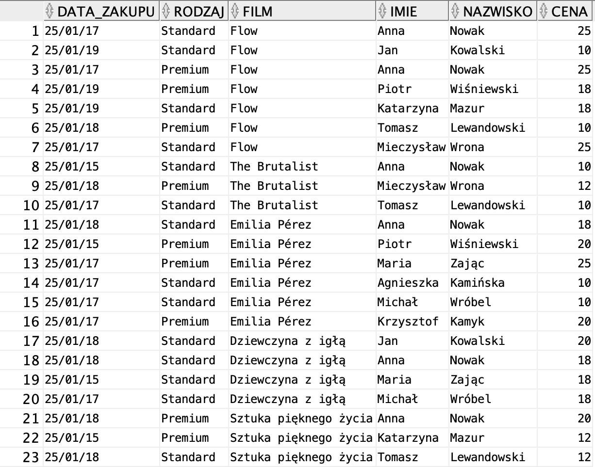
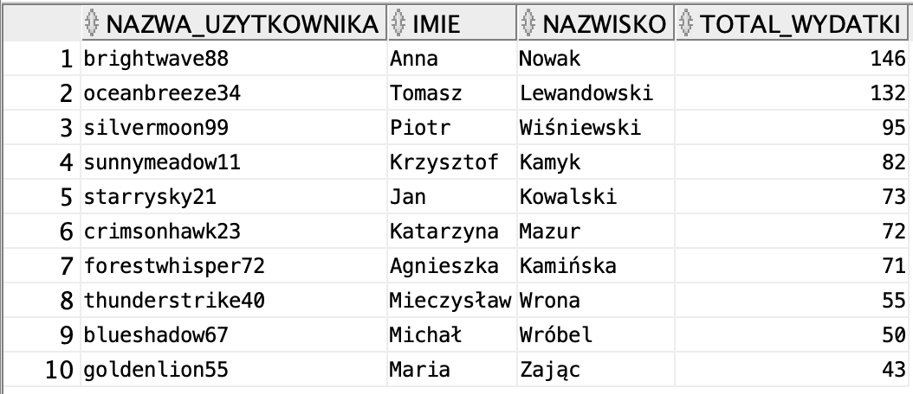
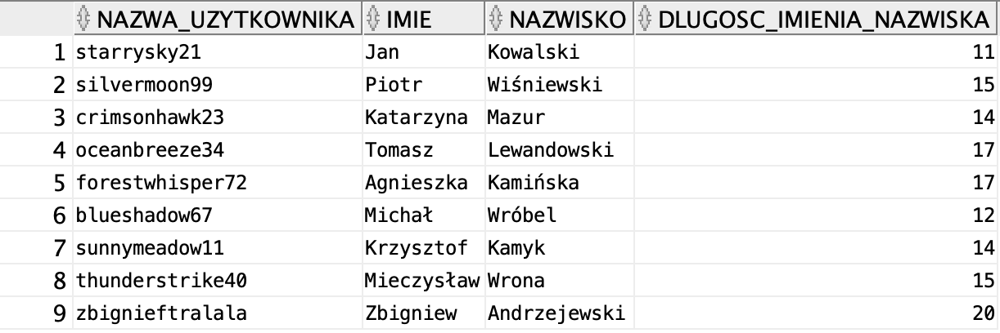
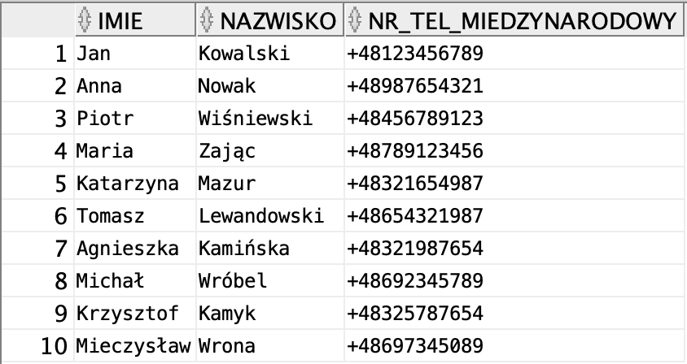
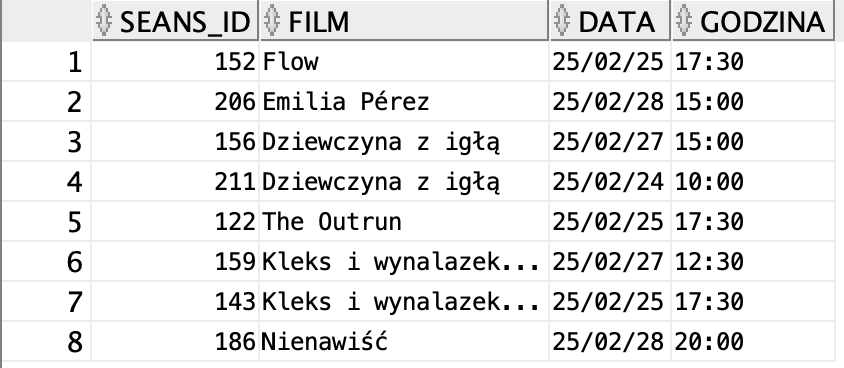
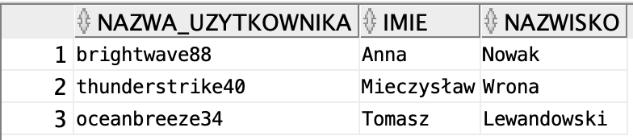

# Projekt Bazy Danych - System Rezerwacji Biletów do Kina

## Opis projektu
Projekt bazy danych systemu rezerwacji biletów do kina został stworzony w ramach zajęć z Baz Danych. Pracowaliśmy nad nim w dwuosobowym zespole. Celem projektu było zaprojektowanie i wdrożenie relacyjnej bazy danych obsługującej system rezerwacji miejsc na seanse filmowe.

## Technologie
Projekt został zrealizowany przy użyciu:
- **Oracle SQL** do zarządzania bazą danych,
- **Oracle SQL Developer** jako środowisko do implementacji bazy,
- **Oracle Data Modeler** do stworzenia modelu encji.

## Model bazy danych
Struktura bazy danych obejmuje kilka głównych encji, takich jak:
- **FILM** - informacje o filmach (nazwa, rok produkcji, czas trwania),
- **REŻYSER** - dane dotyczące reżyserów,
- **GATUNEK** - klasyfikacja filmów według gatunku,
- **SEANS** - szczegóły dotyczące seansów (data, godzina),
- **BILET** - informacje o zakupionych biletach,
- **KLIENT** - dane użytkowników systemu,
- **SALA, MIEJSCE, RZĄD, FOTEL** - struktura sali kinowej i dostępność miejsc.

Model encji:


---

# Podzapytania w SQL

## 1. Suma wydatków użytkowników

**Opis**  
Zapytanie zwraca użytkowników oraz sumę wydatków na bilety.

```sql
SELECT k.nazwa_uzytkownika, k.imie, k.nazwisko, SUM(b.cena) AS total_wydatki
FROM klient k
JOIN bilet b ON k.klient_id = b.klient_id
GROUP BY k.nazwa_uzytkownika, k.imie, k.nazwisko
ORDER BY total_wydatki DESC;
```



---

## 2. Długość imienia i nazwiska użytkowników

**Opis**  
Zapytanie oblicza długość imienia i nazwiska użytkowników.

```sql
SELECT k.nazwa_uzytkownika, k.imie, k.nazwisko, 
       LENGTH(k.imie || ' ' || k.nazwisko) AS dlugosc_imienia_nazwiska
FROM klient k
ORDER BY dlugosc_imienia_nazwiska DESC;
```



---

## 3. Lista użytkowników i ich numery telefonów w formacie międzynarodowym

**Opis**  
Zapytanie zwraca listę użytkowników oraz ich numery telefonów w formacie międzynarodowym.

```sql
SELECT imie, nazwisko, '+48' || nr_tel AS nr_tel_miedzynarodowy
FROM dane_osobowe;
```



---

## 4. Adresy użytkowników

**Opis**  
Zapytanie zwraca imię, nazwisko, adres oraz nazwę użytkownika.

```sql
SELECT d.imie, d.nazwisko, d.adres, k.nazwa_uzytkownika
FROM dane_osobowe d
JOIN klient k ON d.dane_id = k.dane_id;
```



---

## 5. Seanse filmowe z datą i godziną

**Opis**  
Zapytanie zwraca listę seansów wraz z datą i godziną.

```sql
SELECT seans_id, film, data, godzina
FROM seans;
```


---

## 6. Najnowszy film w bazie

**Opis**  
Zapytanie zwraca nazwę najnowszego filmu (według roku produkcji).

```sql
SELECT nazwa
FROM film
ORDER BY rok DESC;
```



---

## 7. Użytkownicy, którzy najczęściej kupują bilety

**Opis**  
Zapytanie zwraca użytkowników, którzy najczęściej kupują bilety (pierwsze 3 rekordy).

```sql
SELECT k.nazwa_uzytkownika, k.imie, k.nazwisko, COUNT(b.bilet_id) AS liczba_biletow
FROM klient k
JOIN bilet b ON k.klient_id = b.klient_id
GROUP BY k.nazwa_uzytkownika, k.imie, k.nazwisko
ORDER BY liczba_biletow DESC;
```


---

## 8. Wybrani użytkownicy według nazwy

**Opis**  
Zapytanie zwraca określonych użytkowników po `nazwa_uzytkownika`.

```sql
SELECT k.nazwa_uzytkownika, k.imie, k.nazwisko
FROM klient k
WHERE k.nazwa_uzytkownika IN ('brightwave88', 'thunderstrike40', 'oceanbreeze34');
```




## Autorzy
Projekt został zrealizowany przez dwuosobowy zespół w ramach zajęć akademickich z Baz Danych.

- [Tomasz Firlej](https://github.com/toniemasz)
- [Dominik Filipiak](https://github.com/Dominik-Filipiak)
