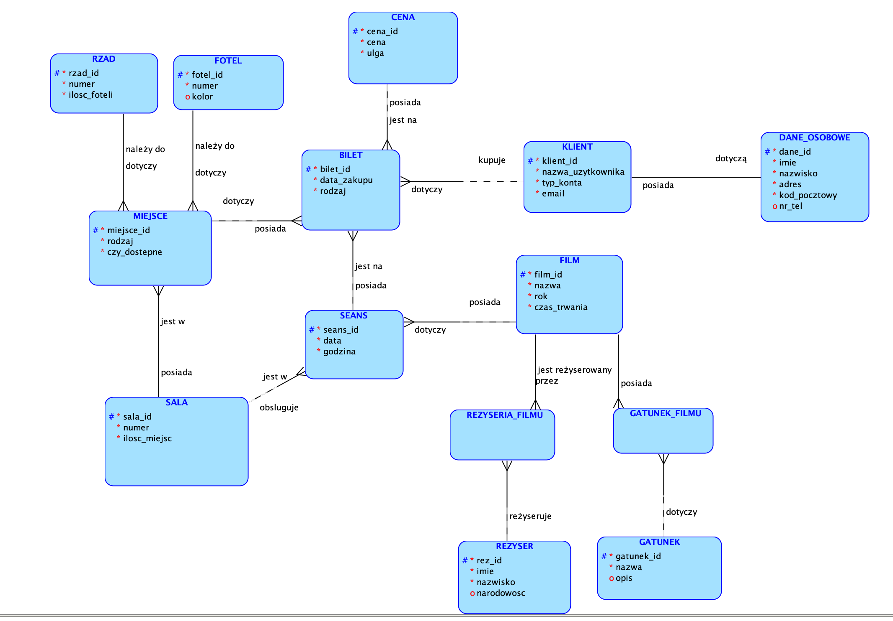

# Projekt Bazy Danych - System Rezerwacji Biletów do Kina

## Opis projektu
Projekt bazy danych systemu rezerwacji biletów do kina został stworzony w ramach zajęć z Baz Danych. Pracowaliśmy nad nim w dwuosobowym zespole. Celem projektu było zaprojektowanie i wdrożenie relacyjnej bazy danych obsługującej system rezerwacji miejsc na seanse filmowe.

## Technologie
Projekt został zrealizowany przy użyciu:
- **Oracle SQL** do zarządzania bazą danych,
- **Oracle SQL Developer** jako środowisko do implementacji bazy,
- **Oracle Data Modeler** do stworzenia modelu encji.

## Model bazy danych
Struktura bazy danych obejmuje kilka głównych encji, takich jak:
- **FILM** - informacje o filmach (nazwa, rok produkcji, czas trwania),
- **REŻYSER** - dane dotyczące reżyserów,
- **GATUNEK** - klasyfikacja filmów według gatunku,
- **SEANS** - szczegóły dotyczące seansów (data, godzina),
- **BILET** - informacje o zakupionych biletach,
- **KLIENT** - dane użytkowników systemu,
- **SALA, MIEJSCE, RZĄD, FOTEL** - struktura sali kinowej i dostępność miejsc.

Model encji:

## Autorzy
Projekt został zrealizowany przez dwuosobowy zespół w ramach zajęć akademickich z Baz Danych.

- [Tomasz Firlej](https://github.com/toniemasz)
- [Dominik Filipiak](https://github.com/Dominik-Filipiak)
